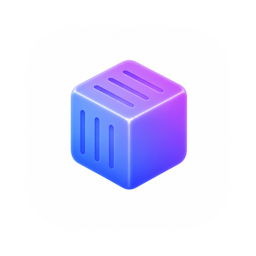
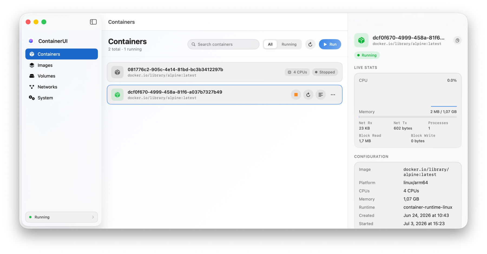

<div align="center">



# ContainerUI

**A native SwiftUI desktop app for Apple's [`container`](https://github.com/apple/container) tool.**

Run and inspect Linux containers, manage images, volumes & networks, and control the<br/>system service — with live resource charts and a ⌘K command palette, from a polished Mac UI.

<a href="https://github.com/kylemclaren/container-ui/actions/workflows/ci.yml"></a>
<a href="https://github.com/kylemclaren/container-ui/releases/latest"></a>
<a href="https://github.com/kylemclaren/container-ui/releases"></a>


<br/>

<picture>
  <source media="(prefers-color-scheme: dark)" srcset="docs/media/containers-dark.png" />
  <source media="(prefers-color-scheme: light)" srcset="docs/media/containers-light.png" />
  
</picture>

</div>

---

**ContainerUI** is a thin, robust GUI **on top of the `container` command-line tool**. It shells out to the supported CLI and decodes its `--format json` output, so it stays compatible across `container` releases instead of binding to internal APIs.

---

## Requirements

- **macOS 26** on **Apple silicon** — required by `container` itself.
- Apple's [`container`](https://github.com/apple/container/releases) tool installed (the signed installer places it at `/usr/local/bin/container`).
- **Xcode 16+** and **[XcodeGen](https://github.com/yonaskolb/XcodeGen)** to build from source.

> The app deploys to macOS 14 so it can launch and show a friendly "not installed" screen, but the backend it drives needs macOS 26.

## Install

Install the latest release with [Homebrew](https://brew.sh):

```bash
brew install --cask kylemclaren/tap/container-ui
```

The `owner/tap/name` form auto-taps [`kylemclaren/homebrew-tap`](https://github.com/kylemclaren/homebrew-tap), so it's a single step — no separate `brew tap` needed. From then on the app updates itself in place.

Prefer a direct download? Grab the DMG from the [latest release](https://github.com/kylemclaren/container-ui/releases/latest), drag **ContainerUI** to Applications, and open it.

### Opening the app (Gatekeeper)

ContainerUI isn't code-signed or notarized yet (that needs a paid Apple Developer account — see [Signing & distribution](#signing--distribution)). Because macOS **quarantines** anything downloaded, Gatekeeper blocks the first launch and reports the app as **"damaged"** or from an **"unidentified developer."** This applies to **both** install paths — Homebrew 5.1 removed the `--no-quarantine` flag, so `brew install --cask` no longer clears it for you.

The reliable fix is to strip the quarantine attribute once, after the app is in `/Applications`:

```bash
xattr -dr com.apple.quarantine /Applications/ContainerUI.app
```

Then open it normally. (Right-click → **Open** works for the "unidentified developer" prompt, but **not** for the "damaged" message that Apple silicon shows for unsigned apps — use the command above.)

Nothing is wrong with the download; this is just how macOS treats software from developers who haven't paid into Apple's notarization program. Once ContainerUI ships notarized builds, this step goes away.

## Build & run

This repo doesn't check in an `.xcodeproj`; it's generated from [`project.yml`](project.yml) with XcodeGen.

```bash
brew install xcodegen          # one-time
xcodegen generate              # creates ContainerUI.xcodeproj
open ContainerUI.xcodeproj    # then Run (⌘R) in Xcode
```

Or from the command line:

```bash
xcodegen generate
xcodebuild -scheme ContainerUI -configuration Debug build
```

### Tests

```bash
xcodegen generate
xcodebuild -scheme ContainerUI -destination 'platform=macOS' test
```

The unit tests are **host-less logic tests**: the test bundle compiles the UI-independent `Core/` sources directly and exercises them with a mock command runner and recorded CLI JSON fixtures — no live `container` backend, no GUI launch. They cover JSON decoding, exact argv construction, error classification, and formatting.

## Architecture

The app talks to `container` through one small, testable seam.

```
SwiftUI Views  ──▶  @Observable ViewModels  ──▶  Services  ──▶  ContainerCLI  ──▶  CommandRunner
 (Features/)         (per feature)              (Core/Services) (Core/CLI)         (Process)
                                                                                       │
                                                          MockCommandRunner ◀──────────┘  (tests)
```

- **`CommandRunner`** (`Core/CLI`) — a protocol over process execution. `ProcessCommandRunner` runs the real binary; `MockCommandRunner` feeds fixtures in tests.
- **`ContainerCLI`** — resolves the `container` binary, runs invocations, classifies failures into a typed `CLIError`, and decodes JSON with a decoder configured to match the CLI's encoder (ISO-8601 dates, no key-strategy remapping).
- **Services** — `ContainerService`, `ImageService`, `VolumeService`, `NetworkService`, `SystemService` build exact argv (via pure, unit-tested `…Arguments(…)` functions) and return `Codable` models.
- **Models** (`Core/Models`) — Swift structs that mirror the CLI's JSON shapes exactly, including the OCI config's PascalCase keys and `snake_case` `diff_ids`/`created_by`.
- **Design system** (`DesignSystem/`) — a small component library (soft pill controls, translucent material cards with gradient hairlines, status badges, springy motion) shared across screens.

### Why shell out to the CLI?

`container`'s Swift packages are only API-stable within patch versions, and talking to its XPC `apiserver` directly requires matching entitlements and tracks internal changes. The CLI is the documented, stable surface, and almost every read command supports `--format json`. Shelling out keeps this app decoupled and resilient — the same approach mature Docker/Podman GUIs take.

## Features

| Area | Capabilities |
|------|--------------|
| **Containers** | List (all/running), **live CPU/memory charts** with real CPU % derived from counter deltas, inspect, start/stop/restart/kill, delete, prune, streaming logs, exec, a full **Run** form (shell-style quoting supported), and a **one-click console** that opens an interactive shell in your terminal app (Terminal, iTerm2, Ghostty, Warp, kitty, Alacritty, WezTerm — pick in Settings). |
| **Images** | List, inspect (config/env/layers/platforms), **Pull** with streaming progress, **run a container straight from an image**, tag, delete, prune. |
| **Volumes** | List, inspect, create (with size/format), delete, prune. |
| **Networks** | List, inspect (subnets/gateway), create (NAT or host-only, custom subnets), delete, prune — with the built-in network protected. |
| **System** | Service status, versions, disk usage, reclaim-space pruning, and start/stop the system service. |
| **Everywhere** | **⌘K command palette** (fuzzy search across every container, image, volume, network, and action), menu-bar quick controls, right-click context menus, and ⌘R refresh of the active screen. |

The app auto-detects the `container` binary (and lets you set a custom path in **Settings**), and surfaces a clear state when the tool isn't installed or the service isn't running.

## Project layout

```
App/            App entry, root navigation, sidebar, settings, backend state
Core/
  CLI/          CommandRunner, ContainerCLI, CLIError, executable resolution
  Models/       Codable models + formatting + image-reference parsing
  Services/     ContainerService, ImageService, SystemService
DesignSystem/   Theme tokens + reusable components
Features/
  Containers/   Containers screen, row, detail, logs, run
  Images/       Images screen, row, detail, pull, tag
  Volumes/      Volumes screen, row, detail, create
  Networks/     Networks screen, row, detail, create
  System/       System screen
Resources/      Assets, entitlements, generated Info.plist
Tests/          Logic tests + fixtures + mock runner
project.yml     XcodeGen project definition
```

## Signing & distribution

The app runs **unsandboxed** (see `Resources/ContainerUI.entitlements`) because it spawns `/usr/local/bin/container`, which talks to a launchd service over XPC — the App Sandbox blocks that. Distribute with **Developer ID + notarization** (Hardened Runtime is enabled), not the Mac App Store. Set your `DEVELOPMENT_TEAM` in `project.yml`, or sign "to run locally" in Xcode for development.

## Releases & CI

Two GitHub Actions workflows live in [`.github/workflows/`](.github/workflows):

- **`ci.yml`** — on every push to `main` and every PR: generates the project, builds, and runs the full test suite.
- **`release.yml`** — on a pushed `v*` tag (or a manual run): builds a Release archive, optionally signs + notarizes it, wraps it in a DMG, and publishes a **GitHub Release** with the DMG and a `SHA256SUMS.txt` attached.

### Cutting a release

```bash
git tag v1.2.0        # the leading "v" is stripped; 1.2.0 becomes the app's version
git push origin v1.2.0
```

The workflow stamps `MARKETING_VERSION` from the tag, so the built app's version always matches the release. A tag containing a hyphen (e.g. `v1.2.0-beta1`) is published as a **pre-release**. You can also trigger `release.yml` manually from the Actions tab (with an optional version input) to produce a DMG artifact without publishing a release.

### Signing & notarization secrets

The release pipeline degrades gracefully — with **no secrets set it still builds and publishes an unsigned DMG**. To ship a Gatekeeper-clean, notarized build, add these repository secrets (Settings → Secrets and variables → Actions):

| Secret | What it is |
|--------|-----------|
| `MACOS_CERTIFICATE_BASE64` | Your **Developer ID Application** certificate + private key exported as a `.p12`, then base64-encoded (`base64 -i cert.p12 \| pbcopy`). |
| `MACOS_CERTIFICATE_PASSWORD` | The password you set when exporting the `.p12`. |
| `APPLE_TEAM_ID` | Your 10-character Apple Developer Team ID. |
| `APPLE_ID` | The Apple ID email used for notarization. |
| `APPLE_APP_SPECIFIC_PASSWORD` | An [app-specific password](https://support.apple.com/en-us/102654) for that Apple ID (used by `notarytool`). |

Behavior by what's present:

- **All five** → signed, notarized, stapled. Opens with a double-click.
- **Just the certificate three** (`MACOS_CERTIFICATE_*`, `APPLE_TEAM_ID`) → signed but not notarized. First launch needs a right-click → **Open**.
- **None** → unsigned. Clear the quarantine flag after copying to `/Applications`:

  ```bash
  xattr -dr com.apple.quarantine /Applications/ContainerUI.app
  ```

The release notes generated for each build spell out which of these applies.

### Building a DMG locally

The workflow just calls scripts you can run yourself:

```bash
VERSION=1.2.0 scripts/build-release.sh          # unsigned; produces dist/ContainerUI-1.2.0.dmg
# or, signed, if a Developer ID identity is in your keychain:
VERSION=1.2.0 SIGNING_IDENTITY="Developer ID Application: You (TEAMID)" TEAM_ID=TEAMID scripts/build-release.sh
```

## Status

v1. This is an independent project and is not affiliated with or endorsed by Apple. It complements the `container` tool, which remains under active development.
